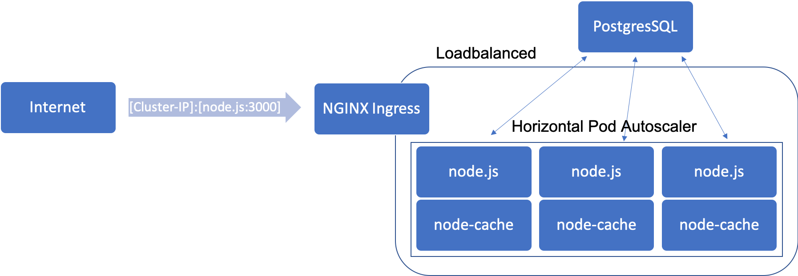

# BigDataProjekt-WIDSB18
Abgabe des Big Data Projekts


## Idee
Die Grundidee hinter diesem Projekt ist es, die aktuellen aktiven Corona Fälle global darzustellen. Hierzu werden die Daten der John Hopkins Universität als Basis genutzt. Es werden die kommulierten neu Infektionen der letzten 14 Tage als Wert zu einem Longitude, Latitude Paar gemappt. [(time_series_covid19_confirmed_global.csv)](https://data.humdata.org/dataset/novel-coronavirus-2019-ncov-cases) 

## Entwurf

Der Grundlegende Entwurf, für diesen Anwendungsfall ist folgender:


Auf der Abbildung ist die Big-Data Pipeline zu sehen. Dazu wird die csv in das HDFS-Cluster gespeichert und dann über einen Connecter in das Kafka Cluster gepusht. Bei einem Trigger wird das Kafka Topic dann von einer Spark Instanz ausgelesen. Pyspark verarbeitet daraufhin die Daten und schreibt diese zuletzt in die PostgreSQL sink. Diese PostgreSQL sink wird dann im Kubernetes-Cluster der Anwendung ausgelesen. 

Leider konnten wir diesen Entwurf aufgrund fehlender Rechenleistung nicht umsetzen und entschieden uns auf Grund dessen für eine um das Kafka Cluster verkürzte Pipeline.


Die Anwednung selber ist wie folgt entworfen:



Die Anwendung basiert auf einer Node.js Anwendung, welche die zuvor in die PostgreSQL Datenbank geschriebenen Daten ausliest und dem Nutzer im Browser darstellt. Der Cache der Node.js Anwendung ist integriert und nutz deshalb bspw. keinen memcache. Der Port 3000 der Node.js Anwendung ist via NGINX Ingress über die Cluster-IP erreichbar. Außerdem sind die Pods der Node.js Anwenung autoscalled.

## Architektur
Im folgenden Abschnitt gehen wir auf die Details ein.

Die Big-Data Pipeline läuft in einer Docker-Compose, da es nicht nötig war, ein Kubernetes-Cluster hierfür aufzusetzen, da die Ressourcen nicht mehr als nur bspw. eine hdfs node zuliesen.
```
#docker-compose der Big-Data Pipeline
services:
    hdfs:
        image: harisekhon/hadoop
        ports:
            - 8020:8020
    spark:
        image: jupyter/pyspark-notebook
        volumes:
            - "./Spark:/home/jovyan/work:rw"
        ports:
            - 8888:8888
    postgres:
        image: stephandiegeilesau/my-postgres-image:1
        ports:
            - 5432:5432
```
Wie dem Docker-compose zu entnehmen ist, werden hier drei Docker-Container gestartet, nämlich der harisekhon/hadoop, jupyter/pyspark-notebook, stephandiegeilesau/my-postgres-image:1. Besonders ist hierbei, dass in den Spark Container die notwendingen Jupyter Notebook files gemounted werden.

Die Anwendung läuft in einem Kubernetes Cluster, welches aus vier .yaml Dateien aufgebaut werden kann. 

Der [nodeFile.yaml](./Cluster/App-Umgebung/nodeFile.yaml) kann entnommen werden, das diese aus einem Service auf den Port 3000 und einem Deployment für den Docker-Container stephandiegeilesau/node-application:latest basiert. Für die Verbindung zu dem PostgresSQL Deployment wird die Umgebungsvariable POSTGRES_URL definiert.

Der [sql-database.yaml](./Cluster/App-Umgebung/sql-database.yaml) kann entnommen werden, das diese einen Service auf den Port 5432 und ein Deployment des Docker-Containers stephandiegeilesau/my-postgres-image:1 beinhaltet.

Der [hpa.yaml](./Cluster/App-Umgebung/hpa.yaml) kann entnommen werden, dass der horizontal pod autoscaller auf dem node-file deployment läuft. Hier wird bei einer CPU utilization von 50% ein neuer Pod gestartet.

Der [ingress.yaml](./Cluster/App-Umgebung/ingress.yaml) kann entnommen werden, dass der NGINX Ingress bei http requests auf ein node-file pod port 3000 verweist.

Wenn wir in die Docker-Container gucken sehen wir in der [node-application/index.js](./Docker-Container/node-application/nodejs/index.js) wie die asynchrone Abfrage der Datenbank über die Umgebungsvariable POSTGRES_URL funktioniert und wie der Cache implementiert wurde:

```
try{
            //The database query will be stored in the cache and only be displayed if the cache read was successfull
            value = cache.get(CACHE_KEY);
            if (value == undefined){
                const client = new Client({
                    connectionString:connectionString
                })
                
                await client.connect()
                console.log("Verbindung hergestellt")
                // In practice here would be just queried for the last 192 entries
                // because the new data will just be inserted not updated in sense of the CR principle
                await client.query('SELECT * FROM average', (err, res) => {
                    if (err) {
                        response.end();
                        return;
                    }
                    //console.log(res.rows)
                    var myJSONString = JSON.stringify(res.rows)
                    cache.set(CACHE_KEY, myJSONString, CACHE_DURATION);
                    console.log("Cache set")
                })
            }else{
                success = true
                console.log("Cache read")
                app.get("/", (req, res) => { res.render("index", { data: value }); });
            }
```

Der gecachte Wert wird 6000 Sekunden aufrecht erhalten.

Wenn wir in die Docker-Container gucken sehen wir in der [my-postgres-image/init.sql](./Docker-Container/my-postgres-image/postgres/init.sql) wie das Datenbank Schema aufgesetzt wird und welche Testdaten eingetragen werden.

## Dokumentation (Setup)
Notwendige Installationen:
- Minikube v1.12.3 with Kubernetes v1.18.3
- Virtualbox
- kubectl v1.19.0
- Docker  v19.03.12


Die Anwendung:


Cmd öffnen und in den Ordner Cluster/App-Umgebung folgendes ausführen:
```
minikube start --driver=virtualbox
minikube addons enable ingress
kubectl apply -f hpa.yaml
kubectl apply -f ingress.yaml
kubectl apply -f nodeFile.yaml
kubectl apply -f sql-database.yaml
minikube ip
```

Kopiere die IP Adresse in den Browser.

Die Big-Data-Umgebung:

Cmd öffnen und in den Cluster/Big-Data-Umgebung folgendes ausführen:
```
docker-compose up

//Dieser Teil hätte in einem bash skript automatisiert werden können mithilfe von metatags im docker-compose
docker ps
//Cluster ID des hadoop kopieren
docker exec -ti {Cluser ID} bash
hdfs dfs -mkdir /data
curl https://data.humdata.org/hxlproxy/api/data-preview.csv?url=https%3A%2F%2Fraw.githubusercontent.com%2FCSSEGISandData%2FCOVID-19%2Fmaster%2Fcsse_covid_19_data%2Fcsse_covid_19_time_series%2Ftime_series_covid19_confirmed_global.csv | hdfs dfs -put -f - /data/time_series_covid19_confirmed_global.csv
hdfs dfs -chmod 777 /data
```
Im Browser öffnet sich das Jupyter Notebook des Pyspark Containers automatisch. Hier im work Ordner das dort befindliche FinalPySpark.ipynb ausführen.

Die PostgreSQL Datenbank des Postgres-Container sollte jetzt mit den Daten befüllt worden sein.

## Screencast

[Link zum Screencast](./images/Screencast.mp4)
